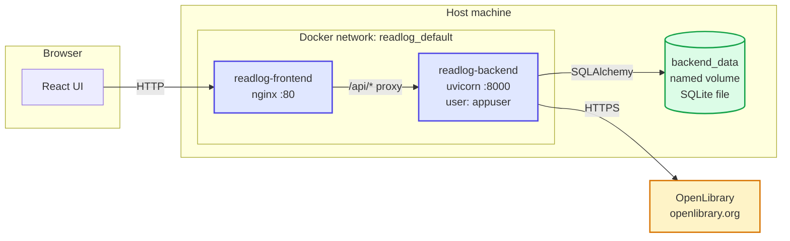
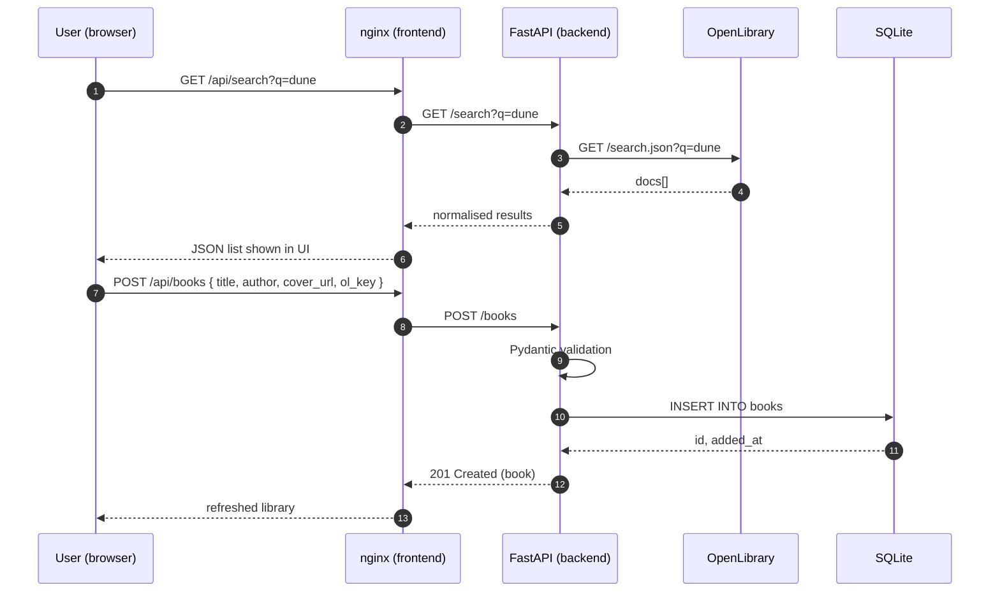
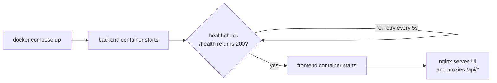

# Architecture — ReadLog

Two views: the **deployment** (what runs where) and the **request flow** (what
happens when the user clicks).

## 1. Deployment view

**Key points**

- Two containers in one private Docker network.
- Only the **frontend** exposes a host port (`:8090 → :80`). The backend is
  unreachable from outside the network.
- The SQLite file lives in a **named volume** so it survives `docker compose
  down`.
- The backend runs as a **non-root** user (`appuser`).
- The browser never talks to OpenLibrary — the backend proxies every call.

## 2. Request flow — adding a book from search

## 3. Boot order

The `depends_on: condition: service_healthy` rule means the frontend never
sees a backend that isn't ready.
